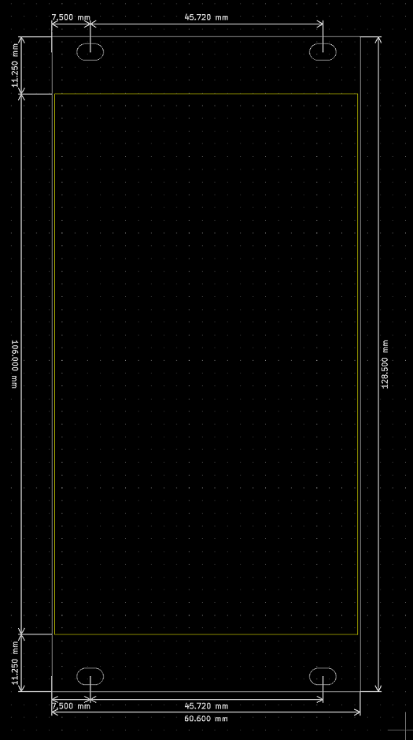
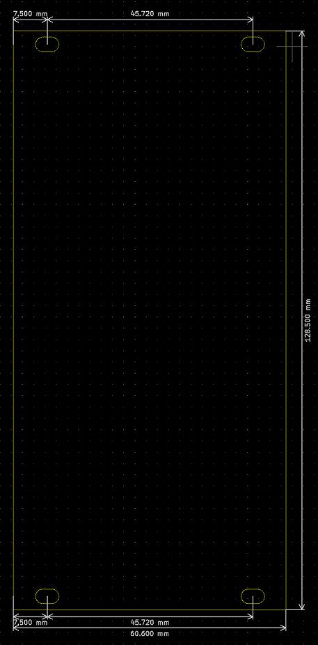
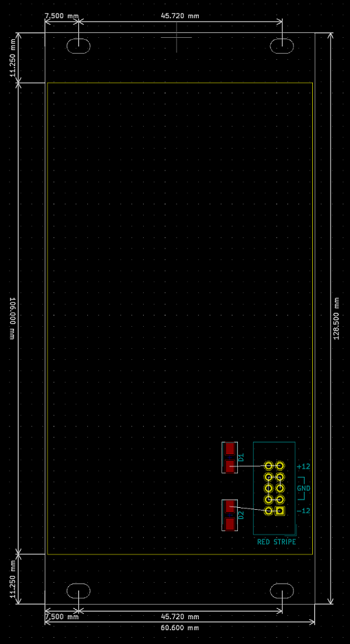

# Eurorack_KiCAD_templates
 Simple templates for starting a modular project. Mix and match parts into a folder for your new project. Each board is a seperate KiCAD project including the front panel.

 ## Connector panels
  For horizontal PCB modules (when the PCB surface is parallel with the front panel) this board holds all the connectors, but could also contain the main circuit if it fits.

  For vertical boards (board surface 90 degrees to front panel) there is no connector panel just main board.

  boards are 106mm high and 1mm smaller in width from the front panel to allow easy fitting next to other modules. In the `Dwgs.user` layer there are dimensions and the outline of the front panel for reference.

  There is a 100mm height version to take advantage of the cheaper PCB pooling 100x100mm limit that many fab houses use.

 ## Front panels
 They are is layed out according to [Doepfer standards](https://www.doepfer.de/a100_man/a100m_e.htm) 128.5mm high and "actual module width" in the table. They have elogated holes for easy adjustment left and right on the rack. 

 

 ## Main boards
 For horizontal PCB modules this board is at the back with a 10 pin Eurorack connector already drawn out in the schematic.

 For vertical boards

 

